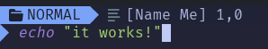

# cmdline highligher
Highlight your cmdline!!  
  
  
  
  
## Installation
Requires 
treesitter regex parser
nvim-0.9.0+
```lua
return {
    {
        'Sam-programs/cmdline-hl.nvim',
        event = 'VimEnter',
        opts = {}
    }
}
```
Default config:
```lua
return {
    {
        'Sam-programs/cmdline-hl.nvim',
        event = 'VimEnter',
        config = function()
            local cmdline_hl = require('cmdline-hl')
            cmdline_hl.setup({
            type_signs = {
                [":"] = { " ", "Title" },
                ["/"] = { " ", "Title" },
                ["?"] = { " ", "Title" },
                ["="] = { " ", "Title" },
            },
            -- custom formatting/highlight for commands
            custom_types = {
                -- ["command-name"] = {
                -- [icon],[icon_hl], default to `:` icon and highlight
                -- [lang], defaults to vim
                -- [showcmd], defaults to false
                -- [pat], defaults to "%w*%s*(.*)"
                -- [code], defaults to nil
                -- }
                -- lang is the treesitter language to use for the commands
                -- showcmd is true if the command should be displayed or to only show the icon
                -- pat is used to extract the part of the command that needs highlighting
                -- the part is matched against the raw command you don't need to worry about ranges
                -- e.g. in '<,>'s/foo/bar/
                -- pat is checked against s/foo/bar
                -- you could also use the 'code' function to extract the part that needs highlighting
                -- ["command-name"]  = false -- to disable a type
                ["lua"] = { icon = " ", icon_hl = "Title", lang = "lua" },
                ["="] = { pat = "=(.*)", lang = "lua", show_cmd = true },
                ["help"] = { icon = "? ", icon_hl = "Title" },
                ["substitute"] = { pat = "%w(.*)", lang = "regex", show_cmd = true },
            },
            input_hl = "Title",
            -- used to highlight the range in the command e.g. '<,>' in '<,>'s
            range_hl = "FloatBorder",
            ghost_text = true,
            -- a function that returns the ghost text to display on the cursor
            -- WARNING: ghost_text_provider isn't called in a safe context use custom ones from plugins like nvim-cmp might result in crashes, 
            -- calling it in a safe context results in the command-line being really slow to update
            -- if you plan on writing one make sure to have a mapping that writes to a file so that you are able to delete the function when it breaks
            -- or you can open a feature request if the below functions aren't sufficient
            -- you can use this to make the ghost text show the item that would be completed by pressing <up> or the next history match like zsh-autosuggest
            ghost_text_provider = require('cmdline-hl').history_ghost_text
            -- this wildmenu function here should work fine with cmp (i think), it works fine with the default completion
            -- ghost_text_provider = require('cmdline-hl').wildmenu_ghost_text
            -- highlight used for rendering ghost text
            ghost_text_hl = 'Comment',
            inline_ghost_text = false,
        })
        end
    }
}
```

## Known issues
Since this uses messages if something echos anything the command-line will disappear, But that's unlikely to happen while editing the command-line, 
I still made a function `disable_msgs` to disable messages in the command-line you can call it with `require('cmdline-hl').disable_msgs()` make sure to call it before your notification plugin loads if you have any.

~~The Press-Enter prompt appears incorrectly when using multiptle commands e.g. `:ls<cr>:ls` you could fix it by pressing space once u see the prompt.~~
🔨 got fixed by some sort of side effect? (this is why you should make good git commits)

Errors in nested command-lines will still render the command-line, e.g. `:<C-r>=f<cr>` raises an error the plugin will keep rendering the cmdline until the user exits the command-line,  
When the Press-Enter bug happens this issue is fixed.
